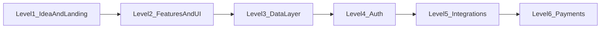

# PRD: German Australian Business Council (gabc.eu) — full site redo

> **Archive note:** Copy of the Cursor plan from April 2026. Deliverables landed in `src/docs/prd/`. Post–Zoom board direction (Squarespace + pretix) is in [chat-closeout-2026-05-22.md](./chat-closeout-2026-05-22.md), not in this plan file.

## Where “Builder Codex” comes from in your repos

- **Canonical codex summary:** [C:/Dev/Atlas/docs/admin/roadmap.md](C:/Dev/Atlas/docs/admin/roadmap.md) — Levels 1–6 (idea → feature → data → accounts → integrations → monetization), pillars: Product, Tooling, Design, Systems, Security, Shipping.
- **Design/voice reference:** [C:/Dev/logans-tools/src/docs/INSPIRATION.md](C:/Dev/logans-tools/src/docs/INSPIRATION.md) (Pirate Skills: hero, content hub, single primary CTA).
- **Acquisition discipline (optional but useful for membership):** [C:/Dev/loganwilliams-website/src/docs/sop-calm-builder-funnel.md](C:/Dev/loganwilliams-website/src/docs/sop-calm-builder-funnel.md) — one channel, one journey, one primary conversion.
- **Note:** Project plans mention `src/docs/builder-codex/` lesson files (e.g. [german-financial-planning-website-plan.md](C:/Dev/logans-tools/src/docs/project-plans/german-financial-planning-website-plan.md)); that directory is **not** in the current workspace. For execution, treat the **Atlas roadmap** as the phase checklist; pull detailed lessons from Pirate Skills only if you subscribe there.

---

## 1. Executive summary

**Product:** New marketing and (optionally) member-facing web presence for **German Australian Business Council e.V.** — a non-political, non-profit business network fostering Germany–Australia business relationships.

**Why redo:** The live site ([gabc.eu](https://gabc.eu/)) communicates the right pillars (events, membership, council story, patrons, chapters, testimonials) but reads as a classic brochure site; content quality issues exist in the wild (e.g. visible copy glitches), and the experience likely under-serves **event discovery**, **membership conversion**, and **ongoing engagement** compared to what members expect in 2026.

**North-star outcomes:**

- **Clarity:** A new visitor understands who GABC is, what membership unlocks, and the next step in under 60 seconds.
- **Conversion:** Higher-quality membership applications and event registrations with fewer support emails.
- **Trust:** Patrons, board, and corporate members presented credibly; legal and nonprofit transparency (Impressum, Datenschutz, Vereinsinfos) are easy to find.
- **Operations:** Council staff/board can update events, news, and member-facing pages without developer dependency (within agreed guardrails).

---

## 2. Problem statement and current state

**Problems to solve**

- Fragmented or weak **information scent** (events vs membership vs chapters vs “about”).
- **Mobile and accessibility** likely lagging modern baseline (WCAG-oriented nav, focus, contrast).
- **SEO / shareability:** weak or inconsistent metadata, OG images, structured data for Organization/Event.
- **Stakeholder content** (patrons, corporate members, testimonials) may be hard to maintain or inconsistent.
- **No clear single primary CTA** per audience segment (visitor vs member vs sponsor).

**Assumptions** (validate with GABC board)

- Primary languages: **English** first; German secondary only if explicitly required.
- Hosting/domain: stay on **gabc.eu**; email and CRM may remain external (Mailchimp, Zoho, etc.) unless scoped.

---

## 3. Goals, non-goals, constraints

**Goals**

- Rebuild IA, visual design, and content model for a **nonprofit chamber-style** org (not a SaaS landing page, but can borrow **clarity** from Pirate Skills–style sites).
- Ship a **Phase 1** marketing site that is fast, accessible, and easy to extend.
- Optional **Phase 2** member portal or gated resources only if GABC commits to ongoing moderation and support.

**Non-goals (initially)**

- Full AMS (association management) replacement unless explicitly funded.
- Heavy custom CMS unless content owners are trained.

**Constraints**

- **GDPR / German nonprofit:** Impressum, Datenschutz, cookie/consent policy where applicable, clear data processing for forms.
- **Brand:** Must remain dignified and institution-credible (patrons include embassy/consulate); avoid “startup hype” tone even if using Pirate Skills **layout** patterns.

---

## 4. Users and jobs-to-be-done

| Persona | Jobs |
|--------|------|
| **Prospective member (individual/SME)** | Understand value, compare membership levels, apply, find first event. |
| **Corporate / institutional prospect** | See credibility, sponsorship/corporate visibility, contact path. |
| **Existing member** | See upcoming events, renew or upgrade, access member news/resources. |
| **Diplomatic / partner org** | Quickly see mission alignment, board contacts, partnership path. |
| **GABC editor (staff/volunteer)** | Publish events/news, update patron lists, fix copy without breaking layout. |

---

## 5. Information architecture (proposed)

**Public**

- **Home** — Positioning, primary CTA (Join / Upcoming events), proof (patrons, testimonials, corporate members).
- **About** — Mission, non-profit status, board, chapters (Frankfurt HQ, Berlin, Munich), history/25+ years narrative.
- **Membership** — Tiers, benefits, FAQ, application flow, payment/review expectations.
- **Events** — List + detail; past highlights optional; registration links or embedded flow.
- **News / Insights** (optional) — Longer shelf-life than events; Australia–Germany business topics.
- **Partners / Patrons** — Embassy, consulate, key sponsors (with permission).
- **Contact** — Form + postal address (Postfach Frankfurt), chapter contacts if distinct.

**Authenticated / gated (Phase 2, optional)**

- Member directory (privacy-controlled), document library, member-only events.

---

## 6. Functional requirements (by phase)

### Phase 1 — Marketing site (MVP)

- Responsive layout; **one primary CTA** on home (e.g. “Become a member” or “View upcoming events” — pick one after stakeholder workshop; secondary CTA for the other).
- **Events:** index + detail, timezone clarity, registration CTA, optional calendar subscribe (ICS) if data model allows.
- **Membership:** explainer + application (form or external link); confirmation messaging.
- **Global:** nav, footer, search optional, **newsletter signup** (single channel aligned with Calm Builder Funnel if marketing owns it).
- **Legal pages:** Impressum, Datenschutz, cookies; accessible from every page.
- **SEO:** unique titles/descriptions, canonical, OG/Twitter, JSON-LD `Organization` + `Event` where applicable; sitemap and robots.
- **Performance:** image optimization, Core Web Vitals budget.
- **Analytics:** privacy-respecting (e.g. Plausible or GA4 with consent mode) — decision recorded in PRD.

### Phase 2 — Member area (optional)

- Auth provider choice (e.g. Clerk — consistent with your other projects) + role model (member, admin).
- Gated content, renewals integration or handoff to payment provider (Stripe for membership fees maps to **Codex Level 6**).
- Admin UI or headless CMS for restricted content.

### Phase 3 — Integrations

- **Email:** double opt-in, sync to list tool; webhook safety if using providers’ APIs (**Codex Level 5**).
- **CRM** (if any): form submissions routed with spam protection (Turnstile/hCaptcha), rate limits, validated inputs (**Zero Trust**).

---

## 7. Content requirements

- Migrate and **edit** core copy from current site: mission, offerings, benefits, chapters, patron titles, testimonials (with permissions).
- **Membership matrix:** clear table of tiers (corporate / business / individual — align to real GABC structure).
- **Media:** high-res patron/org logos, photography guidelines, consistent aspect ratios.
- **Editorial workflow:** who approves publishes (board vs marketing).

---

## 8. Design / UX (Pirate Skills–inspired, institution-appropriate)

From [INSPIRATION.md](C:/Dev/logans-tools/src/docs/INSPIRATION.md), **borrow**:

- Strong **hero** with one sentence value prop and one primary action.
- **Content hub** pattern for Events + News (card grid, scannable).
- Minimal top nav; clear section hierarchy; short paragraphs.

**Do not blindly copy:** Pirate Skills’ bold red/dark brand; GABC needs **trust-first** palette (consider light default with dark optional, or restrained dark theme).

---

## 9. Builder Codex mapping (for implementation planning)

Use this as the **execution checklist** when turning the PRD into sprints:

| Codex level | GABC Phase 1 | GABC later |
|-------------|--------------|------------|
| **L1** | Concept locked, Next.js app, deploy to Vercel, domain | — |
| **L2** | PRD + todos for AI/build; shadcn/ui pages; forms with validation | Iterative UX fixes |
| **L3** | CMS or Supabase for events/news if not static/MDX | Member data |
| **L4** | Skip unless member portal | Login, roles, RLS |
| **L5** | Newsletter webhooks, CRM hooks, spam protection | Automation |
| **L6** | Skip if fees handled off-site | Stripe membership if on-site |

---

## 10. Technical recommendation (aligned with your stack)

- **Framework:** Next.js 16 App Router, TypeScript strict, Tailwind 4, shadcn/ui (matches your existing conventions).
- **Content:** Start with **MDX or headless CMS** (Sanity/Contentful) if non-devs edit weekly; else MDX + Git workflow.
- **Forms:** Server Actions + validation (Zod); no secrets in client.
- **i18n:** English-only v1 unless board mandates DE — then plan hreflang and duplicate content discipline.

---

## 11. Success metrics

- **Acquisition:** Membership applications / month; event registrations / event; newsletter signups.
- **Quality:** Reduced “how do I join?” inbound; bounce rate on membership page; average engagement time on events.
- **Technical:** Lighthouse / CWV thresholds; zero critical a11y violations on key templates.
- **SEO:** Indexed key URLs; branded queries resolve; event pages eligible for rich results where appropriate.

---

## 12. Risks and open decisions

- **Stakeholder alignment** on single primary CTA and membership pricing display (public vs on request).
- **Legal review** of all forms and tracking consent.
- **Content ownership** — without a named editor, CMS investment may be wasted.
- **Scope creep** toward a full AMS; keep Phase 1 strictly marketing + events.

---

## 13. Deliverables checklist (what “done” means for the PRD doc itself)

- Signed-off IA and wireframes (low-fi OK).
- Final copy deck and image manifest.
- Phase 1 vs 2 boundary in writing.
- Analytics + consent approach documented.
- Acceptance criteria per page template (SEO, a11y, performance).
